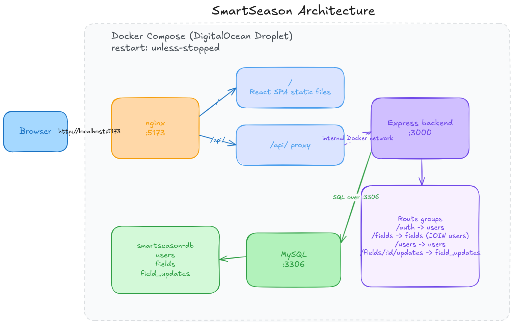

# SmartSeason Field Monitoring System


A web application for tracking crop progress across multiple fields during a growing season. Two roles — **Admin (Coordinator)** and **Field Agent** — with role-scoped dashboards and field update workflows.

**Live demo:** http://206.189.63.155:5173

---

## Table of Contents

- [Stack](#stack)
- [Architecture](#architecture)
- [Setup](#setup)
- [Environment Variables](#environment-variables)
- [Demo Credentials](#demo-credentials)
- [Design Decisions](#design-decisions)
- [Assumptions](#assumptions)
- [API Overview](#api-overview)

---

## Stack

| Layer    | Technology              |
|----------|-------------------------|
| Backend  | Node.js 20, Express     |
| Frontend | React 18, Vite, Axios   |
| Database | MySQL 8                 |
| Infra    | Docker Compose, nginx   |

---

## Architecture



The frontend is an nginx-served static build. All `/api/` requests are proxied by nginx to the Express backend over Docker's internal network — the browser never calls port 3000 directly. Both services and the database run as a single Docker Compose stack on a DigitalOcean Droplet with `restart: unless-stopped`.

---

## Setup

**Prerequisites:** Docker + Docker Compose. Node.js 20 only needed for local dev outside Docker.

### Docker (recommended)

```bash
git clone https://github.com/abdvswmdr/smartseason.git
cd smartseason
cp .env.example .env          # edit values, see Environment Variables below
docker compose up mysql backend frontend -d
```

App runs at `http://localhost:5173`. Schema and seed data load automatically on first run.  
Schema changes require `docker compose down -v` first to reset the data volume.

### Local dev (Docker for DB + backend, Vite dev server)

```bash
./scripts/dev.sh          # kills stray Vite processes, starts Docker services + Vite
./scripts/dev.sh --stop   # tears everything down
```

### Deploy to server

```bash
bash scripts/deploy.sh    # git pull + docker compose up --build
```

---

## Environment Variables

Two `.env.example` files are provided — one at the repo root (Docker Compose) and one at `backend/` (local dev). The only difference is `DB_HOST`:

| Variable         | Docker value | Local dev value |
|------------------|--------------|-----------------|
| `DB_HOST`        | `mysql`      | `localhost`     |
| `FRONTEND_URL`   | server origin e.g. `http://206.189.63.155:5173` | `http://localhost:5173` |
| Everything else  | same         | same            |

---

## Demo Credentials

| Role        | Email                   | Password   |
|-------------|-------------------------|------------|
| Admin       | admin@smartseason.com   | `password` |
| Field Agent | bob@smartseason.com     | `password` |
| Field Agent | carol@smartseason.com   | `password` |

Seed data includes 4 fields across different stages, giving a realistic mix of Active, At Risk, and Completed statuses on first load.

---

## Design Decisions

### Modular monolith

Single Express app split into feature modules (`auth`, `fields`, `updates`, `users`). Each module owns its router and service with no cross-module service calls. Right tradeoff for this scope — navigable codebase without microservices overhead.

### Computed field status — no DB column

Status is derived at read time by `computeStatus(field)` in `fields.service.js`:

| Condition | Status |
|---|---|
| `stage === 'Harvested'` | Completed |
| `stage === 'Planted'` AND planting date > 30 days ago | At Risk — crop stalled |
| `updated_at` > 14 days ago (any stage) | At Risk — agent inactive |
| Otherwise | Active |

No stored column means status never goes stale and logic changes need no migration.

### nginx proxies `/api/` — single origin, no CORS friction

nginx forwards `/api/` to the backend container over Docker's internal network. The Axios client uses a relative base URL (`""`), so the same build works in local Docker, local Vite dev (Vite's built-in proxy handles it), and production — no environment-specific build flags needed.

### npm workspaces monorepo

`package-lock.json` lives at the repo root. Both Dockerfiles use the workspace root as build context so they can access the lockfile and run `npm ci` for reproducible installs (best practice 5.19).

### Deployment — DigitalOcean Droplet

The app is a three-container Docker Compose stack. DigitalOcean was chosen over alternatives for these reasons:

| Option | Why not |
|---|---|
| Heroku | No native Docker Compose support; MySQL only via add-ons with tight free limits; dynos sleep on free tier |
| Render / Railway | Free web services sleep after inactivity — unreliable for a demo |
| Vercel | Frontend-only / serverless; requires splitting backend onto a separate host |

A $6/mo Droplet (1 vCPU, 1GB RAM) comfortably runs all three containers. Cost is covered by the **GitHub Student Developer Pack** DigitalOcean credit ($200, valid until April 2027). `restart: unless-stopped` ensures containers recover automatically from crashes without a process manager.

---

## Assumptions

- Agents are created by the admin (`POST /api/auth/register`), not self-registered.
- Fields always start in `Planted` stage; agents advance the stage via updates.
- `updated_at` on `fields` reflects the last agent update only — admin edits (`PATCH /api/fields/:id`) deliberately do not touch it, so inactivity detection stays accurate.
- Deleting a field cascades to its full update history.

---

## API Overview

```
POST   /api/auth/login              — authenticate, returns JWT
POST   /api/auth/register           — admin only; create agent account
GET    /api/auth/me                 — current user from token

GET    /api/users/agents            — admin only; agent list for assignment dropdown

GET    /api/fields                  — admin: all fields; agent: own fields
POST   /api/fields                  — admin only; create field
PATCH  /api/fields/:id              — admin only; edit field metadata
DELETE /api/fields/:id              — admin only

POST   /api/fields/:id/updates      — assigned agent only; update stage + notes
GET    /api/fields/:id/updates      — admin or assigned agent; update history

GET    /api/health                  — liveness check
```
